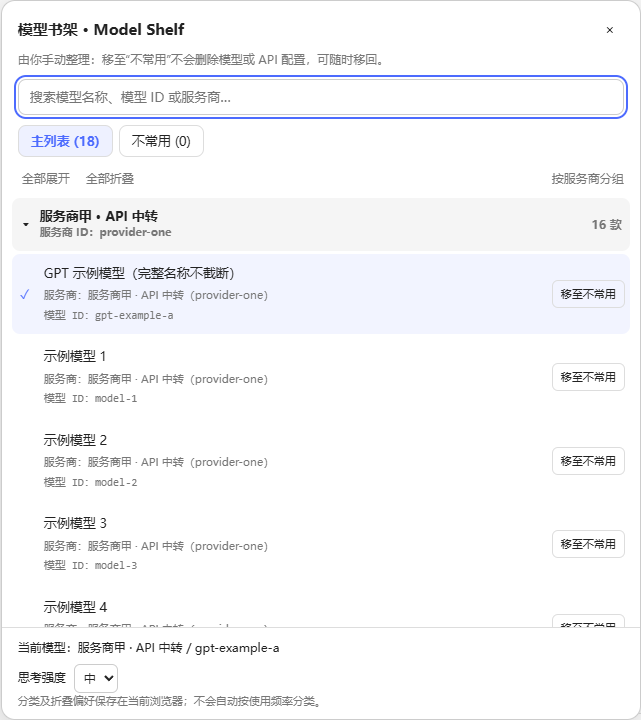
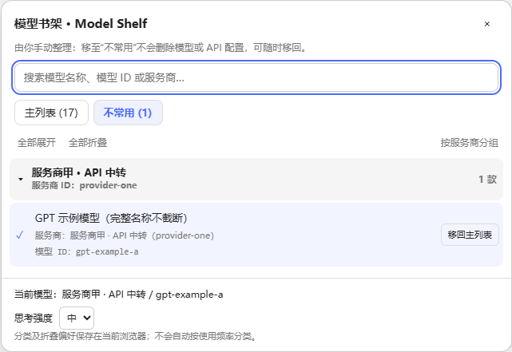
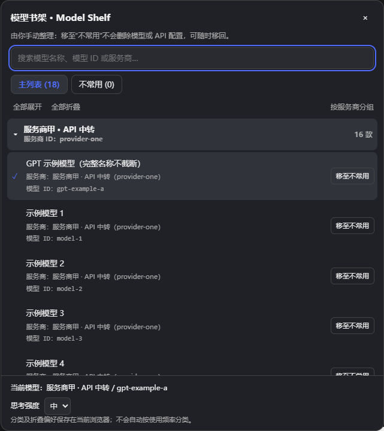

# 模型书架 · DSH Model Shelf

更大的模型选择面板、可折叠的服务商分组，以及**完全由用户手动整理**的“不常用”列表。

> 作者：[Hobartoakes](https://github.com/Hobartoakes) · 许可证：[MIT](LICENSE) · [问题反馈](https://github.com/Hobartoakes/dsh-model-shelf/issues)
>
> 源码公开，**尚未发布 npm 包，也未被 dsh-market 收录**。`private: true` 暂时阻止 npm 发布，不影响 MIT 开源许可或从本地预构建归档安装。

## 演示

以下截图来自离线测试页面，所有服务商、模型名称和 ID 均为演示数据，不包含真实对话、密钥或本机配置。

### 主列表：完整身份与服务商分组



### 不常用列表：手动移入，随时移回



### 深色主题



## 功能

- 选择面板最大宽度 **640px**、最大高度 **720px**，窗口较小时自动收缩。
- 按服务商分组，支持单独折叠、全部展开和全部折叠。
- 主列表 / 不常用两个独立列表，首次使用时所有模型均在主列表。
- **分类仅由你决定**：点击“移至不常用”或“移回主列表”。不统计使用频率，不自动分类。
- 移动分类不会选择模型、删除 API 配置或影响其他服务商的同名模型。
- 每款模型显示模型名称、服务商名称、服务商 ID 和精确模型 ID。
- 以 `(provider ID, model ID)` 区分模型；不同服务商的同名模型互不影响。
- 支持搜索模型名称、模型 ID、服务商名称和服务商 ID；搜索作用于当前列表。
- 搜索临时展开匹配分组，不改变原折叠状态。
- 沿用 DSH 原生模型切换和思考强度选项，保留会话锁定与失败提示。
- 适配宿主浅色 / 深色主题，支持键盘操作。

模型 ID 是服务商目录提供的调用标识。若中转 API 将该标识映射到其他上游模型，插件**无法验证实际上游身份**，不会猜测或额外标注未经验证的模型厂商。

## 兼容性

| 项目 | 已验证范围 |
| --- | --- |
| DSH 宿主 | **0.2.0-rc.2**，元数据暂限定这一版本 |
| 实际环境 | Windows 桌面版 DSH 的现有 Web GUI |
| 浏览器回归测试 | 本机 Microsoft Edge；浅色、深色和窄窗口 |
| 必需服务 | 内置 `modelDirectories`、`sessions`、`remote.session` 和 UI slots |
| 替换位置 | `conversation.input.model`，priority `-100` |

尚未验证其他 DSH 版本、macOS 或 Linux。不要绕过宿主的兼容性检查。同一插槽上的其他增强插件可能与本插件竞争；遇到重复界面或未生效时，先关闭其中一个插件。

## 安装与卸载

当前尚未发布 npm 包，也未被 dsh-market 收录，请不要将包名安装命令当作已可用的公开来源。

本地已构建归档的安装示例（将路径替换为实际归档位置）：

```powershell
dsh plugin --profile desktop add "C:/path/to/dsh-model-shelf-1.0.0.tgz" --ignore-scripts
```

安装后刷新现有 DSH 页面。内置模型选择器保持加载；禁用或卸载本插件后恢复内置选择器。

```powershell
dsh plugin --profile desktop remove dsh-model-shelf
```

归档包含预构建文件，不需要在用户机器上运行安装构建脚本。插件不会修改应用安装包。

早期本地原型名称为 `dsh-model-organizer`。两者占用相同选择器插槽，不建议同时启用；从原型迁移时，先禁用旧插件，再安装新插件。同一浏览器 origin 下首次读取新偏好时，会导入旧原型偏好，且不会删除旧键。已有新偏好时不会覆盖。

## 使用

1. 点击输入框当前模型按钮。
2. 在主列表找到模型，点击右侧“移至不常用”，将该款模型移到独立列表。
3. 切换“不常用”标签页，仍可选择其中的模型，或点击“移回主列表”。
4. 点击服务商标题折叠分组，或使用“全部展开 / 全部折叠”。
5. 搜索结果只来自当前列表；未找到时可切换另一列表继续搜索。

当前模型属于不常用列表时，再次打开选择器会自动打开该列表，但不会改变其分类。

### 键盘

- 搜索框中的 ↑ / ↓：高亮结果；Enter：选择模型。
- Tab / Shift+Tab：在面板控件间移动。
- Escape：关闭面板并返回模型按钮。

## 数据保存与隐私

- 分类和折叠偏好保存在当前浏览器的 `localStorage`，键名为 `dsh-model-shelf.preferences.v1`。
- 仅保存模型身份及折叠分组，不存储 API 密钥、对话内容或调用记录。
- 同一浏览器、同一 origin 的窗口共享偏好，刷新后保留。
- 更换浏览器、设备、访问域名或端口后，不保证共享同一份偏好；清除站点数据会重置。
- **目前不跨设备同步，也不纳入 DSH profile 备份。**
- 浏览器存储不可用时显示警告，当前页面仍可操作，但刷新后可能丢失偏好。
- 卸载不主动清空浏览器偏好，便于重装后恢复。
- 插件不新增外部网络请求；模型目录及切换沿用宿主已有接口，实际模型调用仍受宿主与服务商配置约束。

详见 [隐私说明](docs/PRIVACY.md)。

## 开发与测试

```powershell
pnpm install --frozen-lockfile
pnpm run build
pnpm test
pnpm run test:browser
pnpm pack --pack-destination dist-draft
```

`test:browser` 使用离线 HTML 和模拟目录，不启动 DSH 服务器，也不发起真实模型调用。Windows 默认使用已安装的 Edge；其他平台默认尝试已安装的 Chrome。可通过 `DSH_TEST_BROWSER_EXECUTABLE` 指定浏览器程序路径。其他平台运行测试不等于已验证其 DSH 宿主集成。

另有显式执行的 `pnpm run test:clean-profile`，在 Windows 上用独立 DSH_HOME 和随机本地端口启动临时测试宿主，验证安装 / 禁用 / 重新启用 / 卸载；不替换当前 GUI，结束后停止测试进程。详见 [验证报告](docs/VALIDATION.md)。

React、ReactDOM 和 playwright-core 仅用于开发测试。插件运行时复用 DSH 的 React，不附带第二份 React。

构建是显式步骤，不设置安装期构建钩子。发布前必须重新构建、运行测试，并检查归档内容。

## 发布状态

- 作者：Hobartoakes。
- GitHub 仓库：[Hobartoakes/dsh-model-shelf](https://github.com/Hobartoakes/dsh-model-shelf)。
- 许可证：MIT，详见 [LICENSE](LICENSE)。
- npm 包名：准备期间查询 `dsh-model-shelf` 尚未注册；查询不等于预留，发布前需再次确认。
- npm 发布、GitHub Release 安装包发布、市场收录：尚未执行。

[发布检查清单](docs/RELEASE-CHECKLIST.md) · [版本记录](CHANGELOG.md)

执行 `pnpm run check:release` 检查发布文件。npm 发布前检查还会要求 `private: false`；当前保持 `private: true`，因此 npm 发布仍被阻止。干净 profile 的集成验证记录见 [验证报告](docs/VALIDATION.md)。

## English summary

A wide, collapsible model picker for DSH, with two separate lists: Main and Uncommon. Users explicitly move models between lists; no automatic usage-based classification is performed. Each row shows the provider name, provider ID, model name and model ID. Preferences are stored in the current browser only; no cross-device synchronization is implemented.

Author: **Hobartoakes**. Licensed under **MIT**. Tested with DSH **0.2.0-rc.2** on Windows and Microsoft Edge. Other host versions/platforms are unverified. The source repository is public; npm publication and market listing have not been performed. npm publishing remains disabled (`private: true`).
